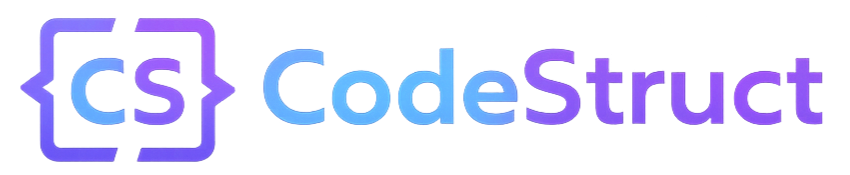

# CodeStruct

<p align="center">
  
</p>

## About
CodeStruct is a modern web application designed to help computer science students and professionals master data structures and algorithms through interactive visualizations, coding exercises, and practice problems. Built with React and TypeScript, this platform provides an engaging way to learn complex algorithmic concepts.

## Key Features
- **Algorithm Visualizations** - See sorting, pathfinding, and tree algorithms in action with step-by-step visual explanations
- **Code Playground** - Write and test code with real-time execution and feedback
- **Practice Problems** - Solve curated DSA challenges with automated testing and detailed solutions
- **User Profiles** - Track your progress, achievements, and learning journey
- **Authentication** - Secure account management with email integration and social login options

## Tech Stack

### Frontend
- **Framework**: React 18 with TypeScript
- **Styling**: Tailwind CSS
- **UI Components**: shadcn/ui (built on Radix UI)
- **Code Editor**: Monaco Editor
- **State Management**: React Context API
- **Routing**: React Router v6
- **Charts & Visualizations**: Recharts

### Backend
- **Database**: Supabase (PostgreSQL)
- **Authentication**: Supabase Auth
- **API**: Supabase REST and Realtime APIs

### Development & Deployment
- **Build Tool**: Vite
- **Deployment**: Vercel

## Getting Started

### Prerequisites
- Node.js (v18 or higher)
- npm or yarn
- Git

### Setup
1. Clone the repository
   ```bash
   git clone https://github.com/adarshsinghh13/CodeStruct.git
   cd CodeStruct
   ```

2. Install dependencies
   ```bash
   npm install
   # or
   yarn
   ```

3. Set up environment variables
   - Copy `.env.example` to `.env.local`
   - Fill in your Supabase credentials

4. Start the development server
   ```bash
   npm run dev
   # or
   yarn dev
   ```

5. Open your browser and navigate to `http://localhost:8080` (or the port shown in your terminal)

## Project Structure

```
/src
  /components        # Reusable UI components
    /ui              # shadcn UI components
    /visualizers     # Algorithm visualization components
  /contexts          # React context providers
  /hooks             # Custom React hooks
  /integrations      # Third-party service integrations
  /lib               # Utility functions and helpers
  /pages             # Application pages/routes
  /db                # Database scripts and helpers
/public              # Static assets
```

## Deployment

### GitHub
1. Create a new repository on GitHub
2. Push your code to GitHub
   ```bash
   git add .
   git commit -m "Initial commit"
   git branch -M main
   git remote add origin https://github.com/adarshsinghh13/CodeStruct.git
   git push -u origin main
   ```

### Vercel
1. Sign up or log in to [Vercel](https://vercel.com)
2. Import your GitHub repository
3. Configure the project:
   - Framework preset: Vite
   - Build command: `npm run build` or `yarn build`
   - Output directory: `dist`
4. Add environment variables from your `.env.local` file
5. Deploy

## Future Enhancements
- Implement more algorithm visualizations
- Add interactive tutorials for common DSA concepts
- Create a community forum for discussing solutions
- Add a competition/challenge system with leaderboards
- Develop a mobile app version

## Performance Optimization
- Code splitting for large components to reduce initial load time
- Memoization of expensive calculations and renders
- Lazy loading of visualizations and code editor
- Database query optimization with pagination and selective fields
- Client-side caching for frequently accessed data
- Error boundaries for better fault tolerance and user experience

## Contributing
Contributions are welcome! Please feel free to submit a Pull Request.

1. Fork the repository
2. Create your feature branch (`git checkout -b feature/amazing-feature`)
3. Commit your changes (`git commit -m 'Add some amazing feature'`)
4. Push to the branch (`git push origin feature/amazing-feature`)
5. Open a Pull Request

## Contact

Sparth Kumar - Developer and Maintainer
- Email: [adarshsinghh13@gmail.com](mailto:adarshsinghh13@gmail.com)
- GitHub: [@adarshsinghh13](https://github.com/adarshsinghh13)
- LinkedIn: [adarshsinghh13](https://www.linkedin.com/in/adarshsinghh13)

Project Link: [https://github.com/adarshsinghh13/CodeStruct](https://github.com/adarshsinghh13/CodeStruct)


